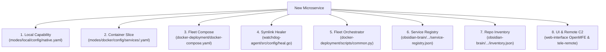

# 🏛️ 03 - Repository Structure & Microservice Creation Standard

This document establishes the authoritative, mandatory standard for repository naming, folder architecture, root files, Makefile automation, coding standards, and ecosystem integration touchpoints for all microservices across the Bastien-Antigravity fleet.

It serves as the definitive reference for both human engineers and AI coding agents (IDE Pair-Programmers, FleetCommander, Orchestrator, Developer, Architect, Sentinel).

---

## 🏷️ 1. Repository Naming Conventions

All repositories in the `Bastien-Antigravity` ecosystem MUST follow strict naming patterns based on their architectural role:

| Category | Naming Pattern | Canonical Examples | Description |
| :--- | :--- | :--- | :--- |
| **Microservices** | `<domain>-server` | `config-server`, `log-server`, `notif-server` | Standalone backend daemons exposing network ports |
| **Agents & Supervisors** | `<domain>-agent` | `watchdog-agent` | Background supervisory, monitoring, or healing agents |
| **Gateways & Adaptors** | `<domain>-gateway` | `mt5-gateway` | Edge protocol adapters and hardware bridges |
| **User Interfaces** | `<domain>-interface` | `web-interface` | Web frontend / dashboard applications |
| **Domain Processing** | `<domain>-<worker>` | `market-observer`, `fundamental-analysis` | Event-driven processing engines |
| **Shared Libraries** | `<feature>-<type>` | `microservice-toolbox`, `universal-logger`, `distributed-config`, `safe-socket`, `flexible-logger` | Polyglot cross-service core libraries |
| **Testing / Sandboxes** | `<domain>-testing` | `sandbox-testing` | E2E integration test harnesses and mock providers |
| **Knowledge Vaults** | `<number>-<Name>` | `obsidian-brain` | Architecture blueprints, BDD specs, and RAG knowledge |

---

## 📋 2. The 12 Mandatory Root Files & Folders Checklist

Every newly created microservice repository in the workspace **MUST** contain the following 12 root elements:

| # | File / Directory | Mandatory Standard & Purpose |
| :-: | :--- | :--- |
| **1** | `standalone.yaml` | **Mandatory Symlink**: Points to `../docker-deployment/modes/local/config/native.yaml`. Registered in `watchdog-agent` self-healing engine (`heal.go`). |
| **2** | `AGENTS.md` | **AI Technical Rulebook**: Mission, exposed capabilities, ports, build/test commands, and forbidden anti-patterns. Ingested automatically into AI system instructions. |
| **3** | `AI-Init.md` / `AI-Project-DNA.md` / `AI-Session-State.md` | **AI Workflow & Context Suite**: `AI-Init.md` (interactive kickoff prompt), `AI-Project-DNA.md` (domain intent & classification), `AI-Session-State.md` (session memory), and `TODO.md` (roadmap checklist). |
| **4** | `Dockerfile` | **Multi-Stage Build**: Complies with `12-Docker-Deployment-Standards.md`. Clones shared library replace directives in builder stage; minimal runtime container. |
| **5** | `docker-compose.yml` | **Local Compose Fragment**: Uses `context: .`, `${HOST_IP:-127.0.0.1}:${PORT}:${PORT}`, and external `teleremote-network`. |
| **6** | `VERSION.txt` | **Canonical Semver SSoT**: Single-line plain text (e.g. `0.0.1`) read dynamically by `Makefile`, CI/CD pipelines, and release workflows. |
| **7** | `.golangci.yml` | **Static Analysis** *(Go services)*: Configures `govet`, `staticcheck`, `ineffassign`, and project exclusion rules. |
| **8** | Language Manifest | **Dependency Manifest**: `go.mod` (Go) / `requirements.txt` (Python) / `Cargo.toml` (Rust) using ecosystem SDKs. |
| **9** | `Makefile` | **Standardized CLI Automation** *(Compiled languages)*: Implements `all`, `build`, `test`, `race`, `vet`, `version`, `clean` with dynamic versioning. Strictly prohibits `\|\| true` and `2>/dev/null`. |
| **10** | `README.md` | **Project Compass**: High-level mission and direct markdown link to `AGENTS.md`. |
| **11** | `.gitignore` | **Standard Protections**: OS caches (`.DS_Store`), python caches (`__pycache__`), binaries (`bin/`, `target/`), and logs (`*.log`). |
| **12** | `quick-overview/` | **Human Onboarding Zone**: Contains human documentation and `.geminiignore`, `.mcpignore`, `.aiignore` so AI agents do not waste context. |

---

## 📁 3. Standard Directory Anatomy by Language

### Go Services (Primary Language)
```text
<service-name>/
├── cmd/
│   └── <service-name>/
│       ├── main.go               # Single-call bootstrap (microservice-toolbox) & lifecycle
│       └── standalone.yaml       # (Symlink if executing directly from cmd/)
├── src/
│   ├── core/                     # Central domain logic & worker controllers
│   │   ├── controller.go         # Domain worker controller
│   │   └── controller_test.go    # Starter unit test with mock logger
│   ├── interfaces/               # Abstract interfaces (zero direct cyclic imports)
│   ├── models/                   # Shared typed structs & telemetry payloads
│   ├── config/                   # Typed capability schemas
│   ├── rest/                     # REST HTTP handlers & OpenMFE asset host (if applicable)
│   └── server/                   # SafeSocket TCP or gRPC network servers (if applicable)
├── quick-overview/               # Human onboarding documentation (isolated from AI)
│   ├── Architecture-Overview.md
│   ├── Features-Behavior.md
│   ├── Testing-Playbook.md
│   ├── General-Misc.md
│   ├── .geminiignore
│   ├── .mcpignore
│   └── .aiignore
├── .github/                      # CI/CD workflows and dependabot
│   ├── workflows/ci.yml
│   ├── dependabot.yml
│   └── CODEOWNERS
├── standalone.yaml               # Symlink -> ../docker-deployment/modes/local/config/native.yaml
├── Dockerfile                    # Multi-stage builder & minimal Alpine runtime
├── docker-compose.yml            # Local fragment compose (teleremote-network)
├── AGENTS.md                     # AI agent operational prompt & rules (machine-ingested)
├── AI-Init.md                    # Interactive session kickoff prompt
├── AI-Project-DNA.md             # Business intent & classification metadata
├── AI-Session-State.md           # AI session memory tracker
├── TODO.md                       # Task checklist & roadmap
├── .golangci.yml                 # Static analysis config
├── .gitignore                    # OS and build artifact protections
├── VERSION.txt                   # Version identifier (e.g. 0.0.1)
├── Makefile                      # Standard build, test, race, vet, version, clean
├── go.mod / go.sum               # Go modules with replace directives
└── README.md                     # Project compass
```

### Python Services (e.g., enhanced-backtesting, fundamental-analysis, 09-RAG-Engine)
```text
<service-name>/
├── main.py                       # Application entry point using microservice-toolbox loader
├── src/
│   ├── core/                     # Domain controllers and worker execution logic
│   ├── interfaces/               # Abstract base classes (ABCs) & typing.Protocol
│   ├── models/                   # Domain models and dataclasses (e.g. StatusPayload)
│   └── lib/                      # Shared helper utilities
├── tests/
│   ├── conftest.py               # Shared pytest fixtures
│   └── test_basic.py             # Starter unit test verifying environment
├── quick-overview/               # Human onboarding (isolated from AI)
│   ├── Architecture-Overview.md
│   ├── Features-Behavior.md
│   ├── Testing-Playbook.md
│   ├── General-Misc.md
│   ├── .geminiignore
│   ├── .mcpignore
│   └── .aiignore
├── .github/
│   ├── workflows/ci.yml
│   └── dependabot.yml
├── standalone.yaml               # Symlink to native.yaml
├── Dockerfile                    # Containerization manifest (Python 3.12-alpine + libunilog.so)
├── docker-compose.yml            # Local fragment compose
├── AGENTS.md                     # AI agent operational prompt & rules (machine-ingested)
├── AI-Init.md                    # Interactive session kickoff prompt
├── AI-Project-DNA.md             # Business intent & classification metadata
├── AI-Session-State.md           # AI session memory tracker
├── TODO.md                       # Task checklist & roadmap
├── requirements.txt              # Dependencies (microservice-toolbox, universal-logger, pytest)
├── .gitignore                    # Python cache and venv protections
├── VERSION.txt                   # Version identifier (e.g. 0.0.1)
└── README.md
```

### Rust Services (e.g., log-server)
```text
<service-name>/
├── src/
│   ├── main.rs                   # Entry point with Tokio async runtime & config loader
│   ├── core/                     # Async engines and ring/reorder buffers
│   ├── servers/                  # Tokio SafeSocket TCP listener & gRPC handlers
│   ├── models/                   # Typed structs
│   └── protocols/                # Length-prefixed framing and Cap'n Proto schemas
├── tests/
│   ├── test_basic.rs             # Unit and integration test suite
├── quick-overview/               # Human onboarding (isolated from AI)
│   ├── Architecture-Overview.md
│   ├── Features-Behavior.md
│   ├── Testing-Playbook.md
│   ├── General-Misc.md
│   ├── .geminiignore
│   ├── .mcpignore
│   └── .aiignore
├── .github/
│   ├── workflows/ci.yml
│   └── dependabot.yml
├── standalone.yaml               # Symlink to native.yaml
├── Dockerfile                    # Rust multi-stage builder (protoc + capnproto)
├── docker-compose.yml            # Local fragment compose
├── AGENTS.md                     # AI agent operational prompt & rules (machine-ingested)
├── AI-Init.md                    # Interactive session kickoff prompt
├── AI-Project-DNA.md             # Business intent & classification metadata
├── AI-Session-State.md           # AI session memory tracker
├── TODO.md                       # Task checklist & roadmap
├── Cargo.toml / Cargo.lock       # Cargo dependencies
├── .gitignore                    # Rust target/ and OS protections
├── VERSION.txt                   # Version identifier (e.g. 0.0.1)
├── Makefile                      # Standard CLI automation with dynamic versioning
└── README.md
```

---

## 🛠️ 4. Standardized Makefile Automation

Compiled language repositories (Go, Rust, C++) MUST provide a root `Makefile` implementing the standardized targets.

> [!IMPORTANT]
> **Python Tooling Purity**: Pure Python repositories **DO NOT** use a `Makefile`. They rely natively on `pytest`, `requirements.txt`, and virtual environments.

### Canonical Go Makefile Template:
```makefile
VERSION ?= $(shell cat VERSION.txt 2>/dev/null || echo "0.0.1")
LDFLAGS := -s -w -X 'github.com/Bastien-Antigravity/$(NAME)/src/core.ServerVersion=$(VERSION)'

.PHONY: all build test race vet version clean

all: build

version:
	@echo $(VERSION)

build:
	@echo "Building $(NAME) (version $(VERSION))..."
	@mkdir -p bin
	go build -ldflags="$(LDFLAGS)" -o bin/$(NAME) ./cmd/$(NAME)

test:
	@echo "Running tests (version $(VERSION))..."
	go test -v ./...

race:
	@echo "Running race detector (version $(VERSION))..."
	go test -race -v ./...

vet:
	@echo "Running go vet..."
	go vet ./...

clean:
	@echo "Cleaning build artifacts..."
	@rm -rf bin/ dist/ build/
```

### Critical Rules for Makefiles:
1. **Dynamic Versioning**: Always extract version via `$(shell cat VERSION.txt 2>/dev/null || echo "0.0.1")`.
2. **Never Mask Errors**: Strict prohibition of `|| true` or `2>/dev/null` on `go build`, `go test`, or `cargo test`. Failures must bubble up to CI/CD and terminal output immediately.
3. **Deterministic Output**: Compiled binaries must be placed in `./bin/<service-name>`.

---

## 🤖 5. Code Standards for AI-Assisted Programming

To ensure flawless code generation by AI agents, every file and package must follow these architectural rules:

### 1. The Triple-Block Header
Every source file (Go, Python, Rust, C++) MUST begin with the standardized Triple-Block header:
```text
ESSENTIAL PROCESS:
High-level statement of what this file does, why it exists, and its domain boundary.

DATA FLOW:
1. Input: Source of triggers, events, requests, or injected configs.
2. Logic: Core domain algorithms and state transitions.
3. Output: Destinations of output, emitted events, telemetry, or structured logs.

KEY PARAMETERS:
List of primary configuration keys, ports, or environment variables controlling behavior.
```

### 2. Section Dividers
Use 80-character dividers between major functions, interfaces, and exported types:
```go
// -----------------------------------------------------------------------------
```

### 3. Universal Bootstrap Ritual
Never manually parse YAML files or read raw environment variables without fallback chains. All services MUST initialize via `microservice-toolbox`:
- **Go**: `appConfig, appLogger := toolbox_bootstrap.BootstrapService("<name>")`
- **Python**: `config = load_config("standalone"); logger = UniLog(app_name="<name>")`
- **Rust**: `let app_config = load_config("standalone")?;`

### 4. Dynamic Port & Address Resolution
Never hardcode host IP addresses or port numbers in code. Ports must be dynamically resolved via configuration capabilities:
```go
addr, err := appConfig.GetListenAddr("<capability_name>")
```

### 5. Encrypted Secrets Standard
Sensitive tokens (passwords, bot tokens, API keys) must be stored in configuration files as `ENC(...)` tokens and decrypted sovereignly at runtime via:
```go
decryptedValue, err := appConfig.DecryptSecret(encryptedToken)
```
Plaintext credentials in committed code or configuration files are strictly forbidden.

### 6. Process Lifecycle & Graceful Termination
All workers, listeners, and background routines must register shutdown hooks with `toolbox_lifecycle.Manager`. Services must cleanly exit on `SIGINT` / `SIGTERM` with status code 0.

---

## 🌐 6. The 8 Ecosystem Integration Touchpoints

Introducing a new microservice requires registering it across **all 8 ecosystem touchpoints**:



| # | Touchpoint File | Required Registration Entry |
| :-: | :--- | :--- |
| **1** | `docker-deployment/modes/local/config/native.yaml` | Add service capability block under `capabilities:` with default `ip` and `${ENV:-port}`. |
| **2** | `docker-deployment/modes/docker/config/services/{name}.yaml` | Create isolated container capability configuration slice for Docker bridge execution. |
| **3** | `docker-deployment/docker-compose.yaml` | Add container service definition with `context: ../{name}`, volume mount for standalone.yaml, and `teleremote-network`. |
| **4** | `watchdog-agent/src/config/heal.go` | Register `filepath.Join(rootDir, "{name}", "standalone.yaml")` in `targets` slice so symlinks heal automatically. |
| **5** | `docker-deployment/scripts/common.py` | Add entry in `SERVICES_SPEC` list for `fleet.sh` compilation (`./fleet.sh compile`) and lifecycle tracking. |
| **6** | `obsidian-brain/05-Fleet-Operation/00-Repo-Control/service-registry.json` | Register service name, Docker image, default port, protocol, archetype, and classification. |
| **7** | `obsidian-brain/05-Fleet-Operation/00-Repo-Control/inventory.json` | Register repository path, remote URL, branch (`develop`), and archetype (`level1-microservice`). |
| **8** | Dynamic UI & Remote C2 *(if applicable)* | - **OpenMFE**: Auto-registers with `web-interface` via `POST /api/v1/register`.<br/>- **Tele-Remote**: Binds to port `1863` via gRPC for Telegram alerts and interactive menus. |

---

## 🚀 7. Automated Scaffolding Tooling (`08-Base-Scripts`)

To eliminate manual boilerplate creation and guarantee compliance with all 12 root files, developers and AI agents **MUST** use the automated scaffolding CLI:

```bash
# Scaffold a new Go microservice
python3 08-Base-Scripts/main.py scaffold-microservice --name market-observer --lang go --port 8092 --desc "Real-time ticker stream ingestor"

# Scaffold a new Python microservice
python3 08-Base-Scripts/main.py scaffold-microservice --name fundamental-analysis --lang python --port 8093 --desc "Financial metrics and SEC filing parser"

# Scaffold a new Rust microservice
python3 08-Base-Scripts/main.py scaffold-microservice --name log-aggregator --lang rust --port 9030 --desc "High-throughput log buffer"

# Preview fabrication without writing to disk
python3 08-Base-Scripts/main.py scaffold-microservice --name orderbook-aggregator --lang go --dry-run
```

### What the Scaffolding Engine Automates:
1. Generates the language directory skeleton (`cmd/`, `src/core`, `src/interfaces`, `src/models`, `tests/`).
2. Creates all 12 mandatory root files (`standalone.yaml` symlink, `Dockerfile`, `docker-compose.yml`, `AGENTS.md`, `AI-Session-State.md`, `.golangci.yml`, `Makefile`, `README.md`, `VERSION.txt`, `go.mod`/`requirements.txt`/`Cargo.toml`, `.gitignore`, `.github/`).
3. Generates working starter unit tests (`controller_test.go` with mock logger for Go, `test_basic.py` for Python, `test_basic.rs` for Rust) ensuring `make test` or `pytest` immediately succeeds.
4. Creates human onboarding zone `quick-overview/` with `.geminiignore`, `.mcpignore`, and `.aiignore`.
5. Establishes the initial BDD behavior specification in `02-Business-BDD/02-Behavior-Specs/<name>/FEAT-001-Initialization.md`.
6. Prints the exact copy-paste configuration snippets for all 8 Ecosystem Integration Touchpoints.

---

## 🚫 8. Prohibited Anti-Patterns Checklist

❌ **NEVER hardcode machine paths** (`/Users/imac/...`, `/home/...`, `~/.local/bin`) in code, scripts, or documentation links.  
❌ **NEVER hardcode ports or IPs** in application source files. Always resolve dynamically via `appConfig.GetListenAddr()`.  
❌ **NEVER commit plaintext credentials**, API tokens, or private keys. Always use encrypted `ENC(...)` tokens.  
❌ **NEVER mask build or test failures** with `|| true` or `2>/dev/null` in Makefiles or CI scripts.  
❌ **NEVER call `os.Exit()`** inside libraries or internal worker methods. Return errors to `main()` or trigger lifecycle shutdown.  
❌ **NEVER break symlink relative depth**. Root `standalone.yaml` must point to `../docker-deployment/modes/local/config/native.yaml`.  
❌ **NEVER duplicate HTML boilerplate** (`<!DOCTYPE html>`, `<html>`, `<head>`) in sub-templates served by `web-interface`.  

---
*Back-links: [[11-Microservice-Integration-Standard]], [[12-Docker-Deployment-Standards]], [[Microservice-Logging-Standard]], [[Web-Interface-Hub]]*
