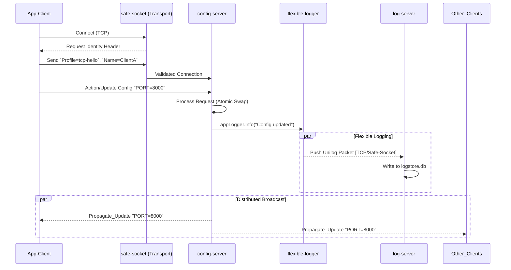

# 🌀 Transverse Event Flow sequences

This document physically maps the boundaries and interactions between isolated microservices to provide a true transversal C4 view.

## Scenario: Client pushing configuration update

This sequence demonstrates standard communication:
1. TCP Handshakes (`safe-socket`)
2. Business Logic Execution (`config-server`)
3. Global Broadcast Notification (`safe-socket`)
4. Asynchronous logging execution (`log-server`)

