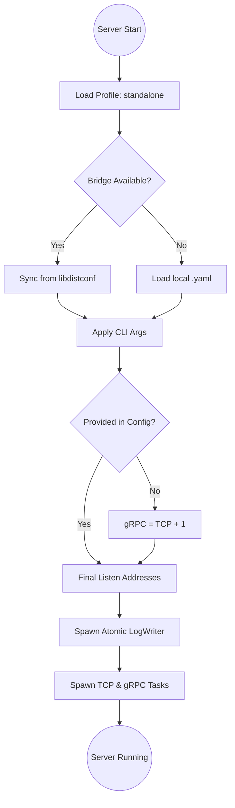

# Log Server Architecture

This document describes the data flow and component hierarchy of the Log Server.

## Data Flow Overview

- **TCP Entry [HARDENED]**: High-performance Cap'n Proto stream requiring a 4-byte BE length prefix and a mandatory Identity Handshake.
- **gRPC Log Bridge**: Interoperability gateway for HTTP/JS clients (Port 15001).
- **Unified Processing**: Both ingestion paths converge into a shared asynchronous pipeline for sequencing and persistent storage.

## Bootstrapping State Machine



## Component Diagram

```text
                        *Optional gRPC support
┌──────────────────┐    ┌──────────────────┐
│   TCP Clients    │    │ Log Bridge (JS)  │
│  ┌─────────────┐ │    │  ┌─────────────┐ │
│  │ App Layer   │ │    │  │ App Layer   │ │
│  └──────┬──────┘ │    │  └──────┬──────┘ │
│  ┌──────▼──────┐ │    │  ┌──────▼──────┐ │
│  │  TcpServer  │ │    │  │BridgeGateway│ │
│  └──────┬──────┘ │    │  └──────┬──────┘ │
│  ┌──────▼──────┐ │    │  ┌──────▼──────┐ │
│  │  SafeSocket  │ │    │  │ gRPC Channel│ │
│  └──────┬──────┘ │    │  └──────┬──────┘ │
└─────────┼────────┘    └─────────┼────────┘
          │                       │
          ▼                       ▼
    ┌─────────────────────────────┐
    │     Protocol Handlers       │
    │  -------------------------- │
    │  (Cap'n Proto / Protobuf)   │
    └──────────────┬──────────────┘
                   │
                   ▼
    ┌─────────────────────────────┐
    │       LogEntry Model        │
    │  -------------------------- │
    │  (Unified Internal Format)  │
    └──────────────┬──────────────┘
                   │
                   ▼
    ┌─────────────────────────────┐
    │       Atomic Sequencer      │
    │  -------------------------- │
    │  (Guarantees Arrival Order) │
    └──────────────┬──────────────┘
                   │
                   ▼
    ┌─────────────────────────────┐
    │         LogWriter           │
    │ ┌─────────────────────────┐ │
    │ │ BTreeMap (Sequencing)   │ │
    │ └────────────┬────────────┘ │
    │ ┌─────────────────────────┐ │
    │ │ Dynamic Batch Writer    │ │
    │ └────────────┬────────────┘ │
    │ ┌─────────────────────────┐ │
    │ │ Retry & Rotation Logic  │ │
    │ └────────────┬────────────┘ │
    └──────────────┼──────────────┘
                   │
                   ▼
    ┌─────────────────────────────┐
    │        File System          │
    │  (logs/_main.log + backups) │
    └─────────────────────────────┘
```

## Key Architectural Decisions

### 1. Sequencing & Ordering
We use an `AtomicU64` counter at the core to assign a unique sequence number to every message as it arrives. The `LogWriter` then uses a `BTreeMap` to buffer and re-order these messages, ensuring the final output file is perfectly chronological even under multi-client concurrency.

### 2. Protocol Agnosticism
The `Protocol Handlers` act as a bridge, converting protocol-specific data (Cap'n Proto or gRPC) into our internal `LogEntry` struct. This decoupling allows us to add new input protocols by simply implementing a new handler.

### 3. High-Performance Disk I/O
The `LogWriter` implements **Dynamic Batching**. It automatically scales the batch size up to 1000 messages during high load to minimize syscalls, and scales down to 10 messages during idle periods to maintain real-time responsiveness.

### 4. Robustness & Hardening
- **Protocol Security**: `TcpServer` enforces a mandatory Handshake immediately upon connection. Anonymous or un-framed data results in immediate disconnection.
- **Retry Logic**: Disk writes are protected by a retry mechanism (default 3 attempts) to handle transient I/O issues.
- **Strict Framing**: `SafeSocket` ensures that even malformed TCP clients won't crash the server.
