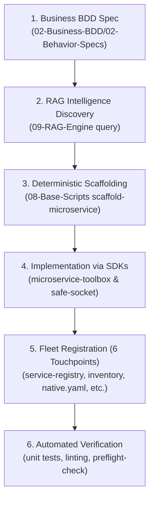

# 🏛️ Microservice Integration Standard Blueprint

This document defines the authoritative, mandatory blueprint for building, bootstrapping, and maintaining microservices across the Bastien-Antigravity ecosystem. It serves as both human operational guidance and an AI agent integration prompt.

---

## 1. Ecosystem Topology & Base Repositories

The core ecosystem (`Bastien-Antigravity-base`) consists of 14 foundational repositories:

| Repository | Responsibility | Key Language |
| :--- | :--- | :--- |
| `distributed-config` | Core distributed config engine (`libdistconf`, CGO bridge) | Go / CGO |
| `config-server` | Central configuration server daemon & REST/gRPC distributor | Go |
| `universal-logger` | Standardized multi-sink logging abstraction (`ILogger`) | Go / Python / Rust |
| `flexible-logger` | Legacy/extended logging engine and adapters | Go |
| `log-server` | High-throughput centralized log streaming daemon | Rust |
| `safe-socket` | High-reliability framed TCP transport library | Go / Rust / Python |
| `microservice-toolbox` | Universal cross-language bootstrap, config, and lifecycle facade | Go / Python / Rust |
| `notif-server` | Multi-channel dispatch engine (Telegram, Discord, Webhooks) | Go |
| `tele-remote` | Remote C2 & telemetry bridge for Telegram bot interfaces | Go |
| `web-interface` | Central monitoring dashboard & OpenMFE host | Go / TypeScript / JS |
| `watchdog-agent` | Process supervisor, health checker, and config symlink healer | Go |
| `docker-deployment` | Containerization, environment profiles, and native templates | Docker / Shell |
| `sandbox-testing` | Integration test harnesses and sandbox runners | Go / Shell |
| `obsidian-brain` | Central documentation vault, architecture records, and RAG Engine | Markdown / Python |

---

## 2. Universal Bootstrap Ritual

All microservices regardless of language **MUST** bootstrap via `microservice-toolbox`. Direct ad-hoc parsing of YAML, direct environment variable lookups without fallback chains, or raw flag parsing is strictly prohibited.

### Go Lifecycle Pattern:
```go
package main

import (
    "os"
    toolbox_bootstrap "github.com/Bastien-Antigravity/microservice-toolbox/go/pkg/bootstrap"
    toolbox_lifecycle "github.com/Bastien-Antigravity/microservice-toolbox/go/pkg/lifecycle"
)

func main() {
    // 1. Initialize configuration and logger in a single call
    appConfig, log := toolbox_bootstrap.BootstrapService("my-service")
    defer log.Close()

    log.Info("Starting my-service under profile: %s", appConfig.Profile)

    // 2. Extract typed capabilities
    var cap MyCapability
    if err := appConfig.Config.GetCapability("my_capability", &cap); err != nil {
        log.Critical("Failed to load required capability: %v", err)
        os.Exit(1)
    }

    // 3. Decrypt sensitive secrets on demand
    decryptedPassword, err := appConfig.DecryptSecret(cap.Password)
    if err != nil {
        log.Critical("Failed to decrypt secret: %v", err)
        os.Exit(1)
    }

    // 4. Setup graceful lifecycle termination
    ctx := toolbox_lifecycle.SignalContext()
    <-ctx.Done()
    log.Info("Shutting down gracefully...")
}
```

### Python Lifecycle Pattern:
```python
from microservice_toolbox import load_config
from universal_logger import get_logger

logger = get_logger("my-service")
app_config = load_config("standalone")

# Access capabilities
db_cap = app_config.get_capability("timescale_db")
decrypted_pass = app_config.decrypt_secret(db_cap.get("password", ""))
```

### Rust Lifecycle Pattern:
```rust
use microservice_toolbox::config::load_config;

fn main() -> Result<(), Box<dyn std::error::Error>> {
    let app_config = load_config("standalone")?;
    // Process typed config and run service loop
    Ok(())
}
```

---

## 3. Configuration & Symlink Architecture

### Single Source of Truth (`native.yaml`)
- The ecosystem stores the canonical native profile in:
  `docker-deployment/modes/local/config/native.yaml`
- Every microservice repository must provide a relative symbolic link:
  `standalone.yaml -> ../docker-deployment/modes/local/config/native.yaml`
- If a repository has sub-services (e.g. `cmd/<service>/standalone.yaml` or `src/config/standalone.yaml`), those locations must also be symlinked.
- **Symlink Self-Healing**: `watchdog-agent/src/config/heal.go` actively monitors all 35 known ecosystem locations and reconstructs missing or broken symlinks at startup.

### Capabilities vs. Local Configuration:
- `capabilities:` defines shared ecosystem resources (`timescale_db`, `rag_engine`, `nats`, `log_server`, `notif_server`, `tele_remote`, `web_interface`).
- Always retrieve capabilities via `appConfig.Config.GetCapability("name", &struct)`.
- Never call `appConfig.GetLocal("timescale_db.*")` because shared resources do not reside in the un-synced `local:` block.

### Secrets Encryption:
- Any sensitive field (tokens, passwords, private keys) stored in YAML is prefixed with `ENC(...)`.
- Services call `appConfig.DecryptSecret(field)` at runtime.
- Never write plain passwords into git or committed `.yaml` files.

---

## 4. Inter-Service Communication Standards

### 1. Centralized Logging (`universal-logger` / `log-server`)
- All components write logs through the unified `ILogger` interface.
- In production / networked profiles, logs stream over TCP using framed packets (`safe-socket`) to `log-server` on port `9020`.

### 2. Remote Telemetry & C2 (`tele-remote`)
- Distributed worker components register their interactive UI schemas and push alerts to `tele-remote` via gRPC on port `1863`.
- `tele-remote` provides the Telegram user interface with zero-latency caching and dynamic background sync.

### 3. OpenMFE Dynamic Web UI (`web-interface`)
- Frontends and REST microservices export micro-frontends (MFEs) dynamically registering with `web-interface` (port `5000`) via `POST /api/v1/register`.
- Default port for `web-interface` is always **`5000`** (never `8000` or `8080`).

### 4. Framed TCP Transport (`safe-socket`)
- Used for low-overhead, high-throughput streaming (e.g., between agents and `log-server`).
- Employs 4-byte length-prefixed framing and 30-second heartbeat pings to detect half-open sockets.

---

## 5. Sovereign Microservice Lifecycle (BDD, RAG & Scaffolding)

All new microservices and major feature modifications must proceed through the standardized 6-step lifecycle:



### 1. BDD Specification First (`02-Business-BDD`)
- Before writing implementation code, create or consult the feature specification in `02-Business-BDD/02-Behavior-Specs/<service>/FEAT-*.md`.
- Ensure each feature contains:
  - **Business Intent**: Clear user story and problem solved.
  - **Gherkin Scenarios**: Structured `Given` / `When` / `Then` / `And` behavioral contracts.
  - **Technical Constraints**: Network protocols, timeout bounds, and persistence semantics.

### 2. Semantic Context Discovery via RAG (`09-RAG-Engine`)
- Use the hybrid semantic RAG engine to query interfaces, schemas, and ADRs:
  ```bash
  python3 09-RAG-Engine/main.py query "<protocol or service pattern>"
  ```
- Eliminates context loss, prevents duplicate abstraction layers, and guarantees interface parity.

### 3. Automated Scaffolding Tooling (`08-Base-Scripts`)
- Use the canonical CLI scaffolder in `08-Base-Scripts`:
  ```bash
  python3 08-Base-Scripts/main.py scaffold-microservice --name <name> --lang <go|python|rust> --port <port>
  ```
- This automatically generates:
  - Language skeleton (`cmd/`, `src/core`, `src/interfaces`, `src/models`, `tests/`)
  - The 12 mandatory root files/folders adhering to [[03-Repository-Structure|Repository Structure Standard]]
  - Starter unit tests (`controller_test.go` / `test_basic.py` / `test_basic.rs`) ensuring immediate test passing
  - The human onboarding folder (`quick-overview/`) with ignore files
  - Initial BDD specification note in `02-Business-BDD/02-Behavior-Specs/<name>/FEAT-001-Initialization.md`.

### 4. Fleet Registration (The 8 Touchpoints)
Every microservice must complete all 8 registration touchpoints before being declared operational:
1. **Local Capability Profile**: `docker-deployment/modes/local/config/native.yaml`
2. **Container Configuration Slice**: `docker-deployment/modes/docker/config/services/{name}.yaml`
3. **Container Orchestration**: `docker-deployment/docker-compose.yaml`
4. **Symlink Auto-Healer**: `watchdog-agent/src/config/heal.go`
5. **Fleet Orchestration & Compilation**: `docker-deployment/scripts/common.py` (`SERVICES_SPEC`)
6. **Service Registry**: `obsidian-brain/05-Fleet-Operation/00-Repo-Control/service-registry.json`
7. **Repository Inventory**: `obsidian-brain/05-Fleet-Operation/00-Repo-Control/inventory.json`
8. **Dynamic UI / C2 Bridge**: `web-interface` (OpenMFE) and `tele-remote` (gRPC menu)

---

## 6. Coding & Documentation Standards for AI Integration

To enable frictionless AI-assisted paired programming and autonomous maintenance, every repository must adhere to the following standards:

### 1. `AGENTS.md` Context File
Every repository root must include an `AGENTS.md` describing:
- The mission and operational boundaries of the service.
- Exact build, test, and run commands.
- Key configuration dependencies and capabilities consumed/exposed.
- Inter-service networking contracts.
- Forbidden patterns and critical pitfalls.

### 2. `AI-Session-State.md` File
Tracks current AI session tasks, active trace IDs, and known issues. Located in the repository root.

### 3. The Triple-Block Header
Every source code file must start with:
```text
ESSENTIAL PROCESS:
High-level statement of what this file does and why it exists.

DATA FLOW:
1. Input: Source of triggers/data
2. Logic: Core transformations
3. Output: Destinations of output/logs/events

KEY PARAMETERS:
List of primary configuration keys controlling behavior.
```

### 4. Section Dividers & Explicit Types
- Use 80-character dividers between exported functions and logical sections.
- Keep function signatures strictly typed. Avoid `interface{}` / `Any` unless required for generic marshaling.

---

## 7. Prohibited Anti-Patterns Checklist

❌ **NEVER** hardcode ports or IPs in application logic. Always resolve via `appConfig.GetListenAddr()` or capability configuration.  
❌ **NEVER** perform filesystem searches in user home directories (`~/.local/bin`, `/Users/...`) to resolve runtime binaries. Use standard `$PATH` resolution or relative workspace binaries.  
❌ **NEVER** commit unencrypted plaintext credentials or tokens.  
❌ **NEVER** bypass `microservice-toolbox` with ad-hoc flag or config parsing.  
❌ **NEVER** invoke `os.Exit()` directly deep inside library logic. Propagate errors to `main()` or call lifecycle shutdown hooks.  
❌ **NEVER** leave broken relative symlinks for `standalone.yaml`.
