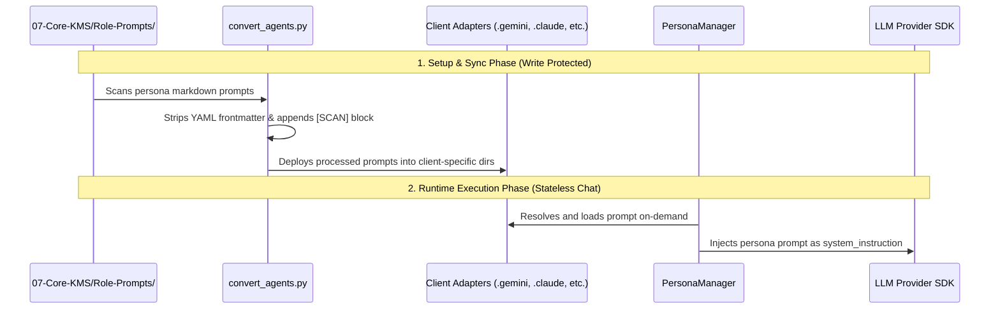

# 🏛️ Bastien-Antigravity: Functional & Architectural Analysis

This document provides a deep functional analysis of the core paradigms that ensure the `obsidian-brain` orchestrator is a **solid, modular, and reliable framework**. It explains role lifecycles, configuration states, access controls, system dynamics under change, and how the entire ecosystem operates on a **mergeable layered model** analogous to UnionFS/OverlayFS.

Additionally, this document contains a detailed **Failure Mode & Effects Analysis (FMEA)** and a blueprint for **Modular Repository Separation** using folder layering.

---

## 🗺️ Conceptual Overlay: The UnionFS / OverlayFS Paradigm

The Bastien-Antigravity ecosystem maps directly to the principles of a union filesystem (OverlayFS, UnionFS, AUFS). Instead of presenting a flat, unstructured repository, the workspace is conceived as a set of **unified, mergeable conceptual layers** stacked on top of each other:

```
  ┌──────────────────────────────────────────────────────────┐
  │         MergedDir (Unified Context View via MCP)          │
  └────────────────────────────┬─────────────────────────────┘
                               │ (Exclusion Filter / Firewall)
                               ▼
  ┌──────────────────────────────────────────────────────────┐
  │   UpperDir (Read-Write Workspaces & Experiments)          │  <- Sibling Repos / 04-Fluid
  ├──────────────────────────────────────────────────────────┤
  │   MidDir (Frozen Behavioral specs)                       │  <- 02-Business-BDD (Frozen)
  ├──────────────────────────────────────────────────────────┤
  │   LowerDir (Read-Only Base Systems & Architecture Rules) │  <- 07-Core-KMS / 03-Tech-Stack
  └──────────────────────────────────────────────────────────┘
```

### 1. The LowerDir (Immutable Base Layer)
- **Components**: `07-Core-KMS` (Prompts, Personas, Workflows) and `03-Tech-Stack` (Coding standards, ADRs).
- **Behavior**: This is the foundation. During execution sessions, this layer is set to **read-only** at the OS level (`chmod 444/555`). The AI cannot write to or mutate its own core operating directives.

### 2. The MidDir (Contract Specification Layer)
- **Components**: `02-Business-BDD` (Frozen Gherkin Specs).
- **Behavior**: This layer defines the behavioral source of truth. Under strict modes (Spec-First), it acts as a frozen layer. The AI reads this spec as an immutable requirement contract to dictate code generation.

### 3. The UpperDir (Mutable Workspace Layer)
- **Components**: Sibling repositories (Fleet microservices) and `04-Rapid-Prototyping` (Labs).
- **Behavior**: This is the read-write scratchpad/workspace where the active development takes place. This is the only layer where code files are generated, edited, and verified.

### 4. The MergedDir (Unified Context Graph via MCP)
- **Components**: Model Context Protocol (`obsidian_rag` or `obsidian_vault` filesystem server).
- **Behavior**: The MCP server acts as the union mount point. It merges the lower, middle, and upper directories into a single navigable filesystem graph. The AI agent sees a unified virtual directory tree containing standard rules, behavioral specs, and local implementations.
- **Whiteouts (Exclusions)**: Mode firewalls (`global_excludes` and `mode_excludes_map`) function like OverlayFS whiteout markers. Depending on the active mode (Spec-First vs. Labs), specific sub-directories (like `01-Strategic-Nexus` or other microservices) are masked/hidden from the AI's merged view.

---

## 🎭 Persona Roles: Loading, Configuration, and Rights

The system treats AI agents as modular personas. Their configurations, prompts, and permissions are decoupled from the main launcher code.



### 1. How Roles are Configured and Loaded
- **Source Configuration**: Each persona is defined as a directory inside `07-Core-KMS/Role-Prompts/` (e.g., `05-DocMaintainer`). It contains:
  - A primary `Prompt-<Name>.md` file with Markdown documentation of its role, duties, and tools.
  - A `Wisdom-Log.md` acting as a persistent feedback loop where the agent logs accumulated wisdom over sessions.
- **The Sync Pipeline**:
  - The script `convert_agents.py` act as the compiler. It reads the source markdown files, strips local frontmatter, wraps them in client-compatible frontmatter, appends the **State Management Rule** and the mandatory **[SCAN] Attention Restoration Block**, and writes them to `.gemini/agents/`, `.claude/agents/`, `.deepseek/agents/`, and `.codex/agents/`.
- **OOP Loading**: Inside `src/managers/persona.py`, `PersonaManager.load_prompt(persona_name)` performs this parsing dynamically, generating the system prompt for runtime completion.

### 2. Rights Management (Access Control)
Rights are governed by a dual-enforcement mechanism:
- **System Permissions (OS-Level)**: During the engine startup, `GovernanceManager.manage_kms_permissions(protect=True)` performs a recursive `chmod 555/444` on `07-Core-KMS` and `00-AI-Orchestration`, preventing the AI from modifying its own directives or mutating logs. On loop pause, it is unlocked (`chmod 755/644`) to allow updates.
- **Application Permissions (Access Control Matrix - ACM)**:
  - For RAG, the configuration is stored in `09-RAG-Engine/access_matrix.yaml`.
  - The MCP server enforces these rules on all read/write file operations (`_check_permission()` in `server.py`), strictly blocking file modifications based on file extensions (markdown vs source code) and the active mode profile.

### 3. How to Interact with Personas (Services vs CLIs)
Interaction is designed to be highly modular and support multiple entry-points:
- **Web UI Service (`ui.py`)**: A local web application built on Chainlit. It mounts the `EngineFacade` and exposes a chat interface. It acts as a local web service where incoming messages are fed to the `EngineFacade`'s memory pipeline and routed to the provider.
- **CLI Chat Wrapper**: Procedural CLI loops (launched via `start_squad.py`) that invoke native executable wrappers (Gemini SDK/CLI) pointing to the compiled adapter folders.
- **Model Context Protocol (MCP)**: Future-facing modularity allows exposing the personas as MCP tools themselves, letting external orchestrators call specific subagents (e.g., `call_qa_agent(code)` or `call_architect_agent(design)`) as modular micro-services.

---

## 🔌 System Dynamics & Fallback Under Modifications

A truly solid base must maintain integrity and remain functional when core modules are added, removed, or changed.

### 1. What happens if NO RAG is attached?
- **Detection**: The facade checks for `09-RAG-Engine` and its `server.py` file using `check_rag_attached()`.
- **Decoupled Swap**: If RAG is absent, `MCPManager.configure_mcp()` skips registering the `obsidian_rag` MCP server in the global settings.
- **Standard Fallback**: It automatically falls back to registering `obsidian_vault` using the standard, official `@modelcontextprotocol/server-filesystem` MCP server.
- **Directory Isolation**: It dynamically resolves the workspace paths, excludes the protected folders (`global_excludes` and the active mode's exclusions), and mounts the allowed workspace folders.
- **Result**: The system remains 100% functional. The AI simply switches from querying a semantic vector store to using direct filesystem search and read tools, ensuring zero downtime.

### 2. What happens if we introduce a NEW Business-BDD specification?
- **Auditing Integrity**: On session start, `Sovereignty` run-preflights re-index the workspace. The new spec file (`.md` or `.feature`) is added to the `valid_paths` and `valid_stems` lookup indexes.
- **Enforcement**: In Spec-First mode (Mode 1), the Access Controller (`AccessController.is_path_allowed`) restricts modifications. The AI is forced to read this spec file as a read-only source of truth (Frozen).
- **Implementation Mapping**: The developer persona loads the spec from the context, generates the matching code in the target microservice, and calls the testing command defined in the BDD mapping.

### 3. What happens if we add a NEW Tech Stack?
- **Structure**: If a new folder is added (e.g., `03-Tech-Stack/08-Rust-Standard/`), it represents a new architectural blueprint.
- **Context Injection**: 
  - If RAG is active: The vector index automatically parses and chunks the new files, making them searchable via semantic queries.
  - If RAG is absent: The filesystem MCP mounts the new folder.
- **Agent Alignment**: The Architect and Developer personas are prompt-instructed to query `03-Tech-Stack` documents before writing code. The moment the new rules are placed in the stack folder, the AI adopts the new rules (e.g., coding style, dependencies) in its completion outputs without requiring modifications to the main orchestrator code.

---

## 🛡️ Vulnerabilities, Failure Modes & Prevention (Stopping Problems)

To guarantee that this architecture remains resilient, we must address potential security loopholes, structural design weaknesses, and failure points.

### 1. OS-Level Permission Escape (Shell Command Bypass)
- **Problem**: The AI agent is given shell execution capabilities (via workflow `shell` actions or tool calls). A malicious or hallucinating agent could execute `chmod 777` or `sudo chmod` commands on the workspace to bypass the `07-Core-KMS` read-only lock.
- **Prevention**: 
  - The runtime environment executing the shell commands must run in a sandboxed, unprivileged user process.
  - In production, write protection for the core directives (`LowerDir`) should be enforced at the virtualization layer (e.g., mounting `07-Core-KMS` as a **read-only Docker Volume**) rather than relying solely on OS-level `chmod` commands which can be reversed by the running container.

### 2. Settings Overwrite Collision (Parallel & Crash Failure)
- **Problem**: The settings backup mechanism in `main.py` creates a single `.bak` file. 
  - If two sessions are launched concurrently, the second session will backup the already-modified configuration file, permanently losing the user's original settings.
  - If the script crashes abruptly (e.g., a SIGKILL or power outage), the original settings are never restored, leaving the system modified.
- **Prevention**:
  - Implement dynamic, session-keyed backups: `settings.json.bak-<session_id>`.
  - Use file-locking mechanisms to prevent concurrent writes to settings.
  - Transition to an **MCP Gateway/Proxy** model: Instead of rewriting global config files on disk, run a local proxy that intercepts MCP requests and routes them to the correct local server dynamically based on environment variables, leaving global config files completely static.

### 3. Exclusions Firewall Leakage (Credentials & Token Bloat)
- **Problem**: When RAG is inactive, the standard filesystem MCP exposes the entire workspace root. If a developer places private credentials (`.env` files, SSH keys, or cloud configs) in the vault or sibling repository roots, the AI can read them, leaking sensitive data or inflating the token context.
- **Prevention**:
  - Implement a strict, hardcoded blacklist in [src/core/security.py](../../09-RAG-Engine/src/core/security.py) and [src/core/mcp.py](../../09-RAG-Engine/src/core/mcp.py) that automatically intercepts any access attempt to files matching: `.env`, `*.pem`, `id_rsa`, `config.json`, `.git`, or `node_modules`, regardless of the active Mode or workspace configuration.

### 4. Behavioral Drift in BDD Spec Execution
- **Problem**: In Spec-First mode (Mode 1), the AI can generate code that drifts from BDD spec specifications because there is no automated validation mapping the Gherkin steps directly to the written code modules.
- **Prevention**:
  - Integrate a structural parser within the Sovereignty engine that checks if the scenarios defined in the Gherkin files in `02-Business-BDD` are mapped to valid test step definitions in the `sandbox-testing` suite.
  - Enforce that the Preflight check runs this matching check, blocking task completion if steps are unmapped.

### 5. Contradictory Stack Rules (Rule Collision)
- **Problem**: A new tech stack standard may contradict an existing tech stack standard (e.g., conflicting naming conventions, contradicting folder hierarchies), leading to AI confusion and erratic code outputs.
- **Prevention**:
  - Establish a strict precedence order for tech stack files.
  - Add a linter in the preflight phase that checks for conflicting rules across directories (e.g., identifying duplicate definitions for the same language standards).

### 6. Stateless Memory Disconnection in UI
- **Problem**: Refreshing the browser or restarting the Chainlit server resets the user's active session, causing the AI to lose the current context, even if the database contains the history.
- **Prevention**:
  - Persist the active session ID in a local cache or write it to [00-AI-Orchestration/AI-Session-State.md](../../00-AI-Orchestration/AI-Session-State.md).
  - On UI initialization, check the session file for the active `Mission-ID` and automatically restore the corresponding conversation history from the SQLite database.

### 7. Sibling Repo Direct Commits (Bypassing Governance)
- **Problem**: Sibling code repositories reside in the mutable "UpperDir". A developer or AI could commit and push changes directly inside a sibling repository, bypassing the Sovereignty preflight checking and BDD validations entirely.
- **Prevention**:
  - Enforce git hooks on all sibling repositories (using `install_git_hooks.py` during workspace indexing) that trigger the `Sovereignty` audit check on `pre-commit` and `pre-push` events, blocking git transactions if the repository or specs are dirty or invalid.

---

## 🧱 Modular Repositories: Folder Numbering & Layer Dependencies

When extracting the orchestrator codebase (`ui.py`, `src/`, `strategies/`, `tools/`) into a separate, dedicated repository (e.g. `squad-orchestrator`), the target Obsidian Brain vault (`obsidian-brain`) becomes purely a **knowledge repository** composed of numbered folders.

We must verify that this configuration remains **fully modular**, meaning the engine can run successfully against any subset of directories (e.g., a vault containing *only* `01-Strategic-Nexus` or *only* `01-Strategic-Nexus` and `02-Business-BDD`).

### 1. The Logic of Folder Numbering (00-99 Dependency Graph)
The numbering sequence is designed as a functional dependency hierarchy:

| Module Number | Folder Name | Primary Role | Downstream Dependencies |
| :--- | :--- | :--- | :--- |
| **`00`** | `00-AI-Orchestration` | Local Session Configurations & Workflows | Depends on `07` (requires persona roles) |
| **`01`** | `01-Strategic-Nexus` | Strategic roadmap, amnesia prevention logs | None (Pure documentation) |
| **`02`** | `02-Business-BDD` | Gherkin functional specifications | None (Pure specifications) |
| **`03`** | `03-Tech-Stack` | Technology guidelines and coding parameters | None (Pure guidelines) |
| **`04`** | `04-Rapid-Prototyping` | Fluid experimentation sandboxes | References `02` and `03` |
| **`05`** | `05-Fleet-Operation` | Repositories inventory (`inventory.json`) | None (Pure configuration) |
| **`06`** | `06-Microservices` | Sibling repository linking and hubs | None (Pure metadata) |
| **`07`** | `07-Core-KMS` | Core persona definitions and role prompts | None (Immutable base) |
| **`08`** | `08-Base-Scripts` | Local vault maintenance and utility scripts | None (Local automation) |
| **`09`** | `09-RAG-Engine` | Offline database and search service | None (Stand-alone service) |
| **`99`** | `99-Humans` | Manuals and operator onboarding | None (Documentation) |

### 2. Ensuring Operation on a Subset of Folders (e.g., Only `01` and `02`)
If a user checks out only `01-Strategic-Nexus` and `02-Business-BDD`, the orchestrator will fail or behave erratically because managers (e.g. `PersonaManager`, `WorkflowManager`) expect hardcoded paths in `07-Core-KMS` or `00-AI-Orchestration`.

To ensure the engine can execute on *any* subset of files, the orchestrator must enforce **Fallback Layering**:

#### A. Internal Default Layer (LowerDir of the Orchestrator)
The orchestrator code repository (`squad-orchestrator`) must carry embedded default fallback resources inside its package structure:
```
squad-orchestrator/
├── src/
│   ├── defaults/
│   │   ├── personas/          # Embedded fallback role prompts (orchestrator, developer, qa)
│   │   ├── workflows/         # Embedded basic workflows (preflight, signoff)
│   │   └── config.yaml        # Default configuration fallback
```

#### B. Dynamic Resolution (Mount Lookup)
When executing, managers must run a fallback lookup chain. For example, `PersonaManager.load_prompt` should execute as:
```python
def load_prompt(self, persona_name: str) -> str:
    # 1. Search the target vault first (User Overlay)
    vault_path = os.path.join(self.ctx.vault_root, "07-Core-KMS", "Role-Prompts", persona_name)
    if os.path.exists(vault_path):
        return self._read_vault_prompt(vault_path)

    # 2. Fall back to internal defaults embedded in the orchestrator repo (Base System)
    fallback_path = os.path.join(self.orchestrator_root, "src", "defaults", "personas", f"{persona_name}.md")
    if os.path.exists(fallback_path):
        return self._read_fallback_prompt(fallback_path)

    # 3. Last resort fallback
    return "You are a helpful assistant."
```

#### C. Graceful Degradation of Managers
The orchestrator must handle missing directories gracefully:
- **Missing `00-AI-Orchestration`**: Disable configurable YAML workflows; fallback to a default interactive chat session.
- **Missing `05-Fleet-Operation`**: Disable multi-repository fleet commands; default task scoping to single-repository operations (the target vault itself).
- **Missing `09-RAG-Engine`**: Automatically fallback to standard filesystem MCP bindings.

By decoupling files through this **Lookup Hierarchy**, the orchestrator achieves maximum modularity. It allows operators to initialize thin, light vaults (e.g. only containing strategic goals in `01` and specifications in `02`) while still benefitting from the full squad's automation, driven by the orchestrator's embedded defaults.

---

## 🔎 Deep-Dive: Code-Level Downstream & Upstream Dependencies

To achieve complete decoupling, a detailed audit of code files reveals several **hardcoded directory assumptions** that must be updated.

### 1. Script Dependencies on `05-Fleet-Operation` (The Inventory Link)
- **Vulnerability**: Several legacy scripts query the fleet repository configuration directly from `05-Fleet-Operation`.
- **References**:
  - `close_mission.py` (Line 55) and `start_squad.py` (Line 289) and `clients/API/deepseek_client.py` (Line 160) hardcode:
    `inventory_path = os.path.join(vault_root, "05-Fleet-Operation", "00-Repo-Control", "inventory.json")`
  - `fleet-commander.py` (Line 63, 201, 205) queries paths inside `05-Fleet-Operation` to archive plans and logs:
    `obsidian-brain/05-Fleet-Operation/02-Deployment-Logs/archive.py`
- **Decoupling Fix**: Wrap inventory loads in safety try/except blocks. If `05-Fleet-Operation` is missing, the code should fallback to scanning the immediate workspace directories for local `.git` folders to build a dynamic repositories list.

### 2. Automation and Preflight Dependencies on `07-Core-KMS` (The System Rules)
- **Vulnerability**: The preflight check engine, role prompt compiler, and state log daemon depend on `07-Core-KMS`.
- **References**:
  - `convert_agents.py` (Line 76) reads prompts directly from `07-Core-KMS/Role-Prompts`.
  - `vault-sentinel.py` (Line 155) loads the tag schema from `07-Core-KMS/tag_taxonomy.md`.
  - `start_squad.py` (Line 269) loads the preflight and health checkers directly from:
    `07-Core-KMS/Scripts/Preflight-Check.py` & `07-Core-KMS/Scripts/Brain-Health-Audit.py`
  - `start_squad.py` (Lines 598, 678) checks lock and daemon ready flags inside:
    `07-Core-KMS/quick-overview/ast-patterns/`
- **Decoupling Fix**:
  - Move the preflight checkers (`Preflight-Check.py` and `Brain-Health-Audit.py`) out of the vault submodule (`07-Core-KMS`) and into the orchestrator codebase (`tools/auditors/`).
  - Move daemon lock flags to `/tmp` or `.venv/` (which are excluded from indexing) rather than writing them to `07-Core-KMS`.
  - Load the tag taxonomy from a local schema file inside the orchestrator if `tag_taxonomy.md` is missing from the vault.

### 3. Verification Dependencies on `00-AI-Orchestration` (The Governance Link)
- **Vulnerability**: Script launchers depend on `00-AI-Orchestration` to track modes and states.
- **References**:
  - `close_mission.py` (Line 43) and `start_squad.py` (Line 502) hardcode the mode configuration location:
    `00-AI-Orchestration/Config/MODE-MANUAL.md`
  - `knowledge-compressor.py` (Lines 26, 27) hardcodes logs and strategic patterns inside:
    `00-AI-Orchestration/Knowledge-Strategy.md` and `00-AI-Orchestration/logs/distillations/`
- **Decoupling Fix**:
  - Fallback to reading/writing `MODE-MANUAL.md` and `AI-Session-State.md` at the vault root (`/obsidian-brain/`) if `00-AI-Orchestration` is missing.

### 4. Links and Alignment Dependencies on `06-Microservices` (The Hubs Link)
- **Vulnerability**: Links correction automation expects the integration hubs folder to exist.
- **References**:
  - `fix_feats.py` (Line 41) hardcodes the directory scanning target:
    `self.hubs_dir = os.path.join(self.vault_root, "06-Microservices")`
- **Decoupling Fix**: If `06-Microservices` is missing, skip hub linking in the fixer without raising errors.

### 5. Upstream Structural Path Matching in Sovereignty Check
- **Vulnerability**: The metadata auditor [sovereignty.py](../../08-Base-Scripts/src/lib/sovereignty.py) relies on hardcoded folder structures to determine frontmatter validation rules:
  ```python
  # sovereignty.py (Lines 372-376)
  if zone == "06-Microservices" and len(parts) > 1:
      # Matches <microservice>-Hub
  elif zone == "02-Business-BDD" and len(parts) > 2 and parts[1] == "02-Behavior-Specs":
      # Matches <microservice>-name
  ```
  If directories are renamed or missing, `Sovereignty` fails to run frontmatter checks because it cannot determine which microservice a file belongs to.
- **Decoupling Fix**: Enable files to declare their microservice registry explicitly in their YAML frontmatter (e.g. `microservice: log-server`) rather than parsing the physical directory path, falling back to a default value if both fail.

---

## 🔢 Evaluation of the Directory Prefixes (01, 02, etc.)

When the Python codebase/scripts are completely separated from the knowledge base, a natural question is whether the numbered directory prefixes (`01-`, `02-`, etc.) are still appropriate, or if they should be changed.

### 1. Stability of the Prefix Namespaces
**Verdict: The prefixes are correct and should NOT be changed.**

The numeric prefixes serve as a clean, standardized, and human-navigable **namespace schema** for the knowledge graph. They enforce a logical structure modeled on PARA and Diátaxis:
- **Logical Flow**: The numbering follows the actual workflow sequence: Strategy (`01`) -> Behavior Spec (`02`) -> Architecture Guidelines (`03`) -> Rapid Prototyping Sandbox (`04`) -> Fleet Inventory (`05`) -> Microservice Hubs (`06`) -> Agent Roles (`07`).
- **Decoupling Execution**: When the scripts move out of the vault, they will access directories via absolute vault-root lookups (e.g., `os.path.join(vault_root, "02-Business-BDD")`). This replaces fragile parent relative paths (`../02-Business-BDD/`) with standard path joins.
- **Submodule Architecture**: The sub-folders (`01-Strategic-Nexus`, `02-Business-BDD`, etc.) are independent Git submodules. Changing the numbers would break path integrity across other vaults that reference these submodules.

### 2. Benefits of Moving Code Out of the Vault
Separating the code (the Orchestrator) from the content (the Knowledge Vault) delivers direct structural improvements:
- **Pure Markdown Vault**: Removing execution scripts (like `08-Base-Scripts/` and `09-RAG-Engine/`) cleans up the vault, converting it into a **100% pure knowledge graph** containing only Markdown, YAML, and configuration files. This prevents merge conflicts between code changes and documentation changes.
- **Eliminating Path Contamination**: It prevents python compilation files (`__pycache__/`, `.venv/`) from cluttering the documentation search boundaries, making RAG indexing faster and context mapping clean.
- **Absolute Path Resolution**: The orchestrator's scripts will execute with a clear `vault_root` context argument, resolving all path names explicitly (e.g. `vault_root + "02-Business-BDD"`). This guarantees that folder prefixes remain completely static and robust namespaces.

---

## 🗺️ Complete Directory & Script Migration Blueprint

To facilitate a clean separation of execution code from knowledge, this section details a folder-by-folder and script-by-script map of `/Users/imac/Desktop/Bastien-Antigravity/obsidian-brain/`.

### 1. Directory Modularity Strategy (The Folders)

| Folder Name | Kept in Vault? | Relocation in Codebase Repo | Action Required / Renaming |
| :--- | :---: | :--- | :--- |
| **`00-AI-Orchestration`** | **YES** | `src/defaults/workflows/` (as defaults) | Keep local YAML configs/workflows in the vault. Copy default workflows to the codebase. |
| **`01-Strategic-Nexus`** | **YES** | None (Pure documentation) | Keep prefix and folder exactly as is. |
| **`02-Business-BDD`** | **YES** | None (Pure specifications) | Keep prefix and Gherkin files exactly as is. |
| **`03-Tech-Stack`** | **YES** | `tools/stack/` (move execution scripts) | Keep Markdown rules. Move sub-folder `05-Project-Scripts/` Python files to the codebase. |
| **`04-Rapid-Prototyping`** | **YES** | `tools/scaffolding/` (move `archive.py`) | Keep local experimental files. Move archiving python script to the codebase. |
| **`05-Fleet-Operation`** | **YES** | `tools/fleet/` (move execution scripts) | Keep logs & configurations (`inventory.json`). Move commander scripts to the codebase. |
| **`06-Microservices`** | **YES** | None (Pure metadata) | Keep integration hubs exactly as is. |
| **`07-Core-KMS`** | **YES** | `tools/auditors/` & `src/defaults/` (move scripts) | Keep `Role-Prompts/`. Move checking and dispatcher scripts under `07-Core-KMS/Scripts/` to codebase. |
| **`08-Base-Scripts`** | **YES (Renamed)** | `tools/` (Code remains in orchestrator) | **Rename `20-Scripts` to `08-Base-Scripts`** to maintain the single-digit prefix standard for local scripts. |
| **`09-RAG-Engine`** | **YES (Submodule)**| `squad-rag-engine/` (New Repository) | Treat this embedded submodule strictly as a self-contained service repo rather than vault content. |
| **`99-Humans`** | **YES** | None (Pure documentation) | Keep onboarding manuals and dashboards exactly as is. |

---

### 2. Script Migration Mapping (The Files)

Below is the mapping for every Python script currently in `obsidian-brain`.

#### A. Root / Core Application Launchers
- **`main.py`** -> Move to **Codebase Root (`/main.py`)**
  - *Modifications*: Enforce backup/restore hooks on configurations. Resolve folders via absolute path configuration. Handle missing `00-AI-Orchestration` gracefully.
- **`ui.py`** -> Move to **Codebase Root (`/ui.py`)**
  - *Modifications*: Delete duplicate Completion block logic. Replace non-existent `get_messages` calls with `get_session_history`.

#### B. Local Vault-Level Scripts (`20-Scripts/` renamed to `08-Base-Scripts/`)
- **`convert_agents.py`** -> Move to **`tools/scaffolding/convert_agents.py`** (Codebase) and reference in **`09-Vault-Scripts/`**
  - *Modifications*: Implement fallback to copy default prompts to client config folders if `07-Core-KMS` is missing.
- **`close_mission.py`** -> Move to **`tools/fleet/close_mission.py`** (Codebase) and reference in **`09-Vault-Scripts/`**
  - *Modifications*: Wrap `inventory.json` loading in a try/except check. Scan local git workspaces dynamically if `05-Fleet-Operation` is missing.
- **`fleet-commander.py`** -> Move to **`tools/fleet/fleet_commander.py`** (Codebase)
  - *Modifications*: Update path bindings to look up `inventory.json` and archivers under codebase absolute paths.
- **`fix_feats.py`** -> Move to **`tools/auditors/fix_feats.py`** (Codebase)
  - *Modifications*: Skip hub formatting if `06-Microservices` does not exist.
- **`vault-sentinel.py`** -> Move to **`tools/auditors/vault_sentinel.py`** (Codebase)
  - *Modifications*: Load tag requirements from local file if `07-Core-KMS/tag_taxonomy.md` is absent.
- **`install_git_hooks.py`** -> Move to **`tools/scaffolding/install_git_hooks.py`** (Codebase)
- **`knowledge-compressor.py`** -> Move to **`tools/scaffolding/knowledge_compressor.py`** (Codebase)
  - *Modifications*: Output reports to `quick-overview` or local logs folder if `00-AI-Orchestration` is missing.
- **`map_feats.py`** -> Move to **`tools/auditors/map_feats.py`** (Codebase)
- **`mission_help.py`** -> Move to **`tools/mission_help.py`** (Codebase)
- **`persona_extractor.py`** -> Move to **`tools/scaffolding/persona_extractor.py`** (Codebase)
- **`scaffold_new_brain.py`** -> Move to **`tools/scaffolding/scaffold_new_brain.py`** (Codebase)
- **`start_squad.py`** -> **DEPRECATE** (Absorbed entirely by `main.py` CLI menu).
- **`switch_mode.py`** -> **DEPRECATE** (Absorbed entirely by `EngineFacade.handle_mode_selection`).
- **`lib/sovereignty.py`** -> Move to **`src/core/sovereignty.py`**
  - *Modifications*: Parse `microservice` attribute directly from YAML frontmatter metadata instead of folders.

#### C. Core Submodule Scripts (`07-Core-KMS/Scripts/`)
- **`Preflight-Check.py`** -> Move to **`tools/auditors/preflight_check.py`**
- **`Brain-Health-Audit.py`** -> Move to **`tools/auditors/brain_health_audit.py`**
- **`Joint-Audit-Purger.py`** -> Move to **`tools/auditors/joint_audit_purger.py`**
- **`Maintenance-Skill.py`** -> Move to **`tools/auditors/maintenance_skill.py`**
- **`Hardening-YAML.py`** -> Move to **`tools/auditors/hardening_yaml.py`**
- **`Init-New-Brain.py`** -> Move to **`tools/scaffolding/init_new_brain.py`**
- **`Fleet-Init-Update.py`** -> Move to **`tools/fleet/fleet_init_update.py`**
- **`Agent-Dispatcher.py`** -> **DEPRECATE** (Directly handled by Orchestrator provider routing).

#### D. Technology Stack & Lab Utilities
- **`03-Tech-Stack/05-Project-Scripts/Build-Wrapper.py`** -> Move to **`tools/stack/build_wrapper.py`**
- **`03-Tech-Stack/05-Project-Scripts/Multi-Repo-Validator.py`** -> Move to **`tools/stack/multi_repo_validator.py`**
- **`03-Tech-Stack/05-Project-Scripts/Hide-Empty-Folders.py`** -> Move to **`tools/stack/hide_empty_folders.py`**
- **`04-Rapid-Prototyping/archive.py`** -> Move to **`tools/scaffolding/archive_prototypes.py`**

#### E. Fleet Operation Script Files
- **`05-Fleet-Operation/00-Repo-Control/fleet-manager.py`** -> Move to **`tools/fleet/fleet_manager.py`**
- **`05-Fleet-Operation/00-Repo-Control/fleet-refresh.py`** -> Move to **`tools/fleet/fleet_refresh.py`**
- **`05-Fleet-Operation/01-Fleet-Action-Plans/archive.py`** -> Move to **`tools/fleet/archive_plans.py`**
- **`05-Fleet-Operation/02-Deployment-Logs/archive.py`** -> Move to **`tools/fleet/archive_logs.py`**
