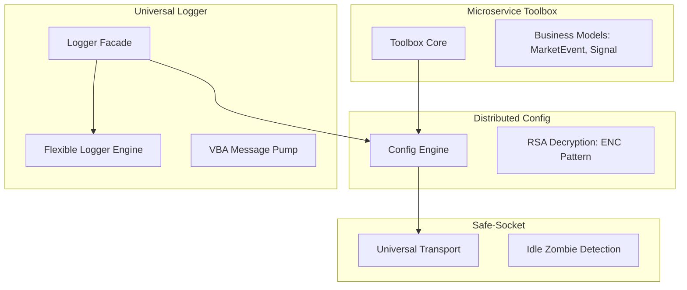

# 📦 Core Libraries and Toolbox

## Library Hierarchy
The Bastien-Antigravity platform uses a layered library architecture. Versions are managed per-repository; always refer to the `VERSION.txt` file at each repository root for the current production baseline.

---
## 1. microservice-toolbox
**Module**: `github.com/Bastien-Antigravity/microservice-toolbox/go`
**Languages**: Go, Rust, Python, C++, VBA
**Role**: The standardized entry point for all microservice configuration, resilience, and networking.

### Key Features
- **Smart Loader**: Implements the "Hierarchy of Truth" (CLI > ENV > YAML > Config-Server).
- **Business Data Standards**: Unified models defined in `schemas/business`:
    - `MarketEvent`: Low-latency L1/L2 data envelope.
    - `OHLCV`: Standardized time-series bars.
    - `Signal`: Unified strategy signals (Buy/Sell/Exit).
- **The Mirroring Mandate**: Go is the source of truth. Features MUST be ported to Python, Rust, and C++ in the same development cycle to maintain parity.

---

## 2. universal-logger
**Module**: `github.com/Bastien-Antigravity/universal-logger`
**Languages**: Go, C++, Python, Rust, VBA (via CGO bridge)
**Role**: Standardized logging facade. Decouples services from the underlying `flexible-logger` engine.

### Advanced Capabilities
- **Shared Dynamic Library**: The Go core is compiled to a shared library (`.dll`, `.so`) used by all language facades.
- **Defensive Marshaling**: Prevents runtime panics by using `yaml:"-"` on internal state fields.
- **VBA Message Pump**: Uses a hidden `HWND_MESSAGE` window to safely bridge multi-threaded Go callbacks into Excel's single-threaded environment.
- **Handle Memory Store**: Tracks sessions via integer handles to minimize FFI overhead.

---

## 3. distributed-config
**Module**: `github.com/Bastien-Antigravity/distributed-config`
**Language**: Go (Reference)
**Role**: YAML-based configuration with environment variable expansion and native RSA decryption.

### Key Features
- **ENC(...) Pattern**: Secrets remain encrypted in memory. Decrypted on-demand via the `DecryptSecret()` API.
- **Error Transparency**: Native support for `GetLastError()` to surface engine-level failures to the language facade.
- **In-Memory Mirroring**: High-performance mirroring ensures sub-millisecond config lookups.

---

## 4. safe-socket
**Module**: `github.com/Bastien-Antigravity/safe-socket`
**Languages**: Go, Python, C API
**Role**: Universal high-performance transport (TCP/UDP/SHM) with **Infinite Wait** resilience.

### Architecture
- **Zombie Detection**: Utilizes adaptive heartbeats to detect dead connections in background streams.
- **Zero-Timeout Reads**: Supports persistent blocking reads while maintaining active health monitoring.

---

## 🔄 Polyglot Development Workflow
Developing across library (parent) and microservice (child) boundaries requires a coordinated ritual.

### 1. Local Override (Simultaneous Dev)
To work on a library and a microservice at the same time without pushing intermediate versions:
- **Go**: Use `go.mod` `replace` directives to point to your local library clone.
- **Python**: Use `pip install -e /path/to/local/lib`.
- **Rust**: Use `[patch.crates-io]` in `Cargo.toml`.

### 2. The Atomic Update Ritual
When a core API change occurs:
1. **Parent Update**: Implement the change in the Go reference library.
2. **Facade Porting**: Immediately port the change to Python, Rust, and C++ facades (Mirroring Mandate).
3. **Integration Test**: Run the `integration/run_tests.sh` suite in the toolbox.
4. **Child Update**: Update the microservice to consume the new library version only after all facades are validated.

---
*Reference: [[01-General-Naming-Conventions]], [[11-Unified-Comment-Standards]]*
